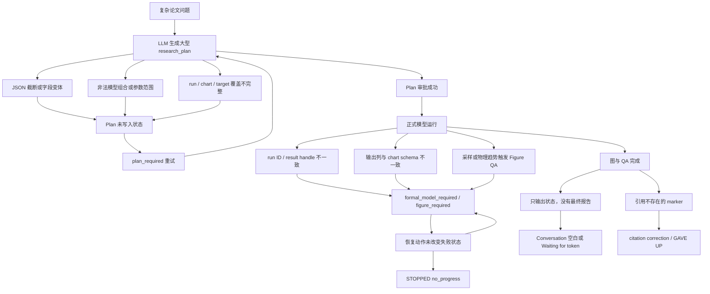

# PhysEarth-Agent 科研工作流不稳定性测试与故障分析报告

> 报告日期：2026-08-14  
> 分析范围：本轮 Basic cases、Representative Q1–Q4 的浏览器端人工审批测试，以及此前为复现这四个问题所暴露的相关故障  
> 证据来源：浏览器 Run trace、`_state/logs/sessions/*.jsonl`、`_state/logs/application.log`、`_state/logs/errors.log`、当前测试记录与代码差异  
> 本报告只记录和分析问题，不新增或修改 Agent 业务逻辑。

## 1. 执行摘要

PhysEarth-Agent 当前已经具备一套真实的科研工作流骨架：读取文献、提出研究计划、人工审批、伪数据图预览、注册模型运行、正式作图、Figure QA、证据与引用检查、最终科研报告。Basic cases 和部分 Representative cases 已经证明该主链路可以完整运行。

但目前的稳定性问题不是单点 bug，而是由四个边界之间的契约不一致叠加造成的：

1. **LLM 与工具参数的边界**：复杂 `research_plan` 容易被截断、生成非法 JSON，或采用系统未兼容的等价字段结构。
2. **研究计划与执行器的边界**：计划中的 run、chart、paper target、模型能力声明和实际输出列之间缺少稳定、统一的标识与覆盖关系。
3. **执行器与 Harness 的边界**：Harness 能正确发现缺 run、缺 figure、低质量 figure 和报告不完整，但不少恢复动作没有改变导致失败的状态，因此反复触发同一个 gate。
4. **后端状态与前端渲染的边界**：流式回答、最终回答、Research review、trace、figure 列表由不同状态源更新，完成瞬间容易发生闪烁、空白、错位或“Waiting for the first token”残留。

最危险的现象并不是某一次模型报错，而是**无进展循环**：同一个 `plan_required`、`formal_model_required`、`figure_required` 或 Figure QA 错误被连续反馈给 LLM，但下一轮没有得到可改变状态的操作。系统随后要么消耗大量调用，要么由防死循环机制以 `STOPPED no_progress` 终止。

本轮测试到报告编写时的结果如下：

| 测试 | 当前结果 | 主要观察 |
|---|---|---|
| Basic 1：SMRT 密度—亮温 | 通过 | 20 点 sweep、正式图、解释与引用均正常 |
| Basic 2：L-band 土壤湿度与植被光学厚度 | 通过 | 人工审批、两组模型、四条曲线、Figure QA 和报告均正常 |
| Basic 3：明确要求不使用工具 | 通过（预期拒绝） | Evidence gate 正确阻止无工具物理结论；不应要求生成图 |
| Q1：六种合法理论/微结构组合 | 通过 | 6 个正式 run、60 点/组、6 条曲线、QA 恢复、最终报告正常 |
| Q2：SMRT 与 DMRT-ML/QMS | 通过，但经历恢复 | 3 个正式 run、2 张正式图；最终报告首次只输出状态，后经 completeness correction 才完成 |
| Q3：SMRT 与 MEMLS | 尚未形成稳定结论 | 多次在 plan coverage、无意义 coefficient/DORT sweep、重复 angular chart、figure coverage 处失败；最新一轮在报告编写时尚未完成正式回归 |
| Q4：微结构等效性 | 历史上既有成功也有失败 | 主要失败集中在不支持的 stickiness sweep、参数越界、run-to-chart coverage 和 Figure QA 恢复 |

因此，当前系统可以称为“**主流程已成立，但复杂论文复现的容错与状态收敛仍不稳定**”。

## 2. 如何理解 Run trace 中的状态

为了避免把安全机制误报为程序崩溃，需要区分以下事件：

| 事件 | 本意 | 是否一定是故障 |
|---|---|---|
| `BLOCKED` / `RESEARCH GATE` | Harness 拒绝不满足约束的动作或报告，并把原因反馈给模型 | 否。单次拦截通常是正确行为 |
| `RESEARCH REVISION` | 系统对失败模型、图表或计划执行自动修复 | 否。能够继续并完成时属于正常恢复 |
| `STOPPED no_progress` | 连续多次没有状态进展，为防死循环而中止 | 是稳定性问题；终止器正常，但上游恢复失败 |
| `STOPPED figure_required` | 多次要求补齐图表仍未补齐 | 是稳定性问题；通常是 run/chart 身份或覆盖关系错误 |
| `GAVE UP citation_integrity` | 多轮改写仍引用不存在的 marker | 是最终报告阶段的恢复失败 |
| `RESEARCH COMPLETE` + citation pass | 模型、图、报告和引用均通过 | 完成 |

日志语料中的累计信号也说明了这一点。当前 session 日志中出现过约 136 次 `formal_model_required`、18 次 `figure_required`、16 次非法工具 JSON、15 次 `no_progress` 停止，同时也有 18 次 `research_complete` 和 19 次 citation pass。这里的次数是 trace 信号数量，不等同于独立 bug 数量，但清楚表明瓶颈集中在**计划—运行—图表覆盖—恢复**这条链路。

## 3. 故障分类总览

| 编号 | 故障类别 | 典型表现 | 严重度 |
|---|---|---|---|
| S1 | 上游 API 与结构化输出 | 429、400、tool JSON 未闭合、输出被截断 | 高 |
| S2 | Context 与调用预算 | 中途达到 context 上限、model/tool budget 提前停止 | 高 |
| S3 | Research phase / 人工审批状态 | 计划提前弹出、按钮无效、确认计划后仍停在 preview | 高 |
| S4 | Plan 生成与 schema 兼容 | 无 plan、少于三步、缺 `action`、等价字段不被接受 | 高 |
| S5 | 论文协议与模型能力冲突 | Q2/Q3/Q4 的参数、模型组合、sweep 不合法 | 高 |
| S6 | Run 与 plan 身份不一致 | run 已成功却仍被判定缺失，unknown run_id | 高 |
| S7 | Chart coverage 与绘图数据契约 | 图为空、列名错误、run 不属于任何图、重复图 | 高 |
| S8 | Figure QA 恢复 | 3 点趋势图、常数曲线、异常跳变后反复重画或退回 plan | 高 |
| S9 | 最终报告与引用 | 提前输出结论、只说“可以继续报告”、citation GAVE UP | 中高 |
| S10 | 前端布局与流式状态 | 面板错位、双滚动条、闪烁、内容清空、文字不可复制 | 中高 |
| S11 | 本地服务生命周期 | 7860 被旧进程占用、重启后无法访问 | 中 |

## 4. 详细问题记录

### 4.1 S1：上游 API、限流与工具 JSON

#### 现象

- ModelScope / ZhipuAI 返回 `HTTP 429`，具体原因是 `insufficient balance`。
- 切换阿里云 Qwen 后出现 `HTTP 400`：`function.arguments` 必须是 JSON。
- `research_plan` 经常在较长输出处被截断，trace 显示：`'{' was never closed`。
- 部分轮次在非法 tool call 后，模型继续重发近似相同的非法参数。

#### 根因

- API 供应商额度、限流和协议兼容性不同。
- 论文复现计划同时包含多个 run、chart、target 和 evidence mapping，结构化参数远大于普通问答工具调用。
- 输出 token 上限不足时，最先被截断的常常是 function arguments 的尾部括号；这不是科研计划本身不可行，而是传输层产生了不完整 JSON。
- 不同 OpenAI-compatible 服务对 tool call JSON 的容忍度不同。

#### 影响

- 计划尚未进入科研可行性验证，就因语法错误退出。
- 用户看到的是“无法生成 plan”，但真实失败发生在 LLM 到工具的序列化层。
- 重试会重复消耗上下文和 API 调用。

#### 已有缓解

- API key 与 Base URL 改为环境变量，支持 ModelScope 与阿里云切换。
- 对非法 JSON 增加严格 JSON 重试提示。
- 本轮观察到复杂计划在 4096 输出 token 下被截断，当前工作区中存在将上限提高到 8192 的未提交改动。

#### 剩余风险

- 仅提高 token 上限不能保证 JSON 原子性。
- 如果模型继续一次生成完整大计划，Q4 一类多 run 计划仍可能接近供应商限制。

### 4.2 S2：Context 与硬预算提前终止

#### 现象

- 页面 context 接近 `96000` 时，Agent 运行到一半停止或页面卡住。
- 曾因 `tool call budget for this question reached (10 of 10)` 或 `model call budget ... (12 of 12)` 中止。
- 取消硬预算后，失败恢复又可能无限消耗模型调用。

#### 根因

- 每次模型调用都会重复携带长 system prompt、能力声明、已读取文献、tool outputs、计划和 trace 修正信息。
- 完整文献 section 可达到数千至一万字符，若重复读入或保留全部工具输出，context 增长很快。
- 固定硬上限可以止损，却不了解当前是否距离科学结果只差一步；完全取消上限又失去无进展保护。

#### 影响

- 合法的长流程被当作预算耗尽终止。
- 用户难以区分“模型上下文窗口不足”“项目自定义预算不足”和“供应商限额不足”。

#### 判断

Context 上限同时包含供应商模型窗口和项目的保守预算设置；不是只调高前端数字即可解决。更关键的是历史压缩、工具结果摘要、阶段性 checkpoint 和按状态计算的动态预算。

### 4.3 S3：Research phase 与人工审批错位

#### 现象

- 用户刚输入问题，内置 `Research review` 就立即弹出，尚未看到模型分析与文献读取。
- `Run it`、`Choose chart in chat`、`Regenerate preview` 曾点击无反应。
- 输入“确认计划”后，系统从 `plan_review` 跳到 `pseudo_preview`，但仍回复“暂停等待确认”，用户无法知道下一步应选图还是再次批准。
- Review 卡片和操作按钮曾跑到 Run trace 上方，甚至在空 session 中残留。
- 伪数据预览曾在用户选择前没有实际图，或者 `PREVIEW, NO DATA` 也被计入 Figures。

#### 根因

- UI 按钮动作、聊天自然语言动作与后端 research phase 不是同一套单一状态机。
- Review 卡片既被当作 trace event，又被当作独立浮层渲染，容易出现重复容器和错误插入位置。
- 前端按钮有的只聚焦聊天框，没有提交对应结构化 action。
- 状态完成后旧 review state 没有原子清理。

#### 影响

- 用户不知道点击是否生效。
- 相同文本“确认计划”在不同 phase 含义不同，容易造成无进展对话。
- 表面上像 Agent 卡住，实际是 phase 已改变但 UI 没有给出可执行控件。

### 4.4 S4：Research plan 无法生成或无法被接受

#### 现象

多次出现以下错误：

- `No LLM-authored research proposal has been submitted.`
- `research_plan() missing 1 required positional argument: 'action'`
- `A proposal requires at least three executable research steps.`
- 模型调用已输出上千 token，但工具仍认为没有合法 proposal。
- `plan_required` 连续出现，最后 `STOPPED plan_no_progress` 或 `STOPPED no_progress`。

#### 根因

1. 工具 schema 与模型实际序列化形式不完全匹配，例如 `coverage` 被生成为对象数组，而系统只接受分散的 `run_ids/chart_ids`。
2. `research_plan` 工具同时承担“生成计划”“修改计划”“审批计划”等 action，模型偶尔省略 action 或误用查询动作。
3. Harness 对“至少三步”的形式要求曾高于真正的执行可行性；模型给出有效 run，但 prose steps 数量不足仍被拒绝。
4. 一些 deterministic repair 在注册模型参数清洗之后才执行，导致本可自动纠正的论文协议先被 schema 拒绝。
5. 错误反馈只描述“哪里不对”，没有给出机器可执行的最小修复补丁，模型倾向于重写整个大计划，从而引入新错误。

#### 典型循环

```text
LLM 生成 research_plan
  → coverage / step / action 校验失败
  → proposal 没有保存
  → 下一轮 research_plan(action=revise/inspect)
  → “No proposal exists yet”
  → 模型再次生成近似计划
  → no_progress 终止
```

这类错误不等于“科研计划不可行”，而是**计划对象没有成功进入状态仓库**。

### 4.5 S5：论文协议、模型能力和参数空间冲突

#### 通用问题

- LLM 从论文语言推导运行参数，但注册模型只接受有限的枚举组合和 sweep 参数。
- 论文中比较的外部模型（DMRT-ML、DMRT-QMS、MEMLS）并未注册为本地可执行模型，只能把论文曲线或统计量作为证据，不能伪装成本地 run。
- Harness 有时要求“完全复刻论文协议”，但当前本地模型能力只允许“部分复现 + 明确 capability gap”。

#### Q1 典型问题

- `rayleigh + exponential` 非法：SMRT Rayleigh 需要具有 particle radius 的 sphere-based microstructure。
- `dmrt_qca_shortrange + exponential` 非法：该 DMRT 实现要求 sticky hard spheres。
- LLM 按自然语言写“Rayleigh theory、IBA、DMRT”，而 run gate 使用精确 run ID / configuration 匹配，导致计划名称与实际配置不一致。
- `Exponential object has no attribute radius` 是能力组合校验过晚，错误直到模型运行时才暴露。

#### Q2 典型问题

- Harness 要求 active backscatter、`dmrt_qca_shortrange`、`dmrt_qcacp_shortrange` 和论文的半无限介质近似条件。
- 模型曾提出错误 thickness（例如 10 m 而非论文协议使用的 200 m 数值近似）。
- 多次只提交 QCA 或 QCA-CP 的一边，下一次又替换成另一边，而不是一次完成成对计划。
- 把论文中的“用 DMRT-QMS 预计算系数代入 SMRT”误解成本地可执行的额外 coefficient run。

#### Q3 典型问题

- MEMLS 不在本地 registry；只能执行 SMRT IBA / IBA-original 和 DORT 收敛诊断，并将 MEMLS 作为文献对照。
- Harness 要求角度 sweep 和两种 IBA formulation，但模型经常只提交其中一种。
- 曾生成 `coefficients over dort_streams`。电磁系数产生于 RT solver 之前，DORT stream 数对这些系数不应形成有意义的 sweep；该 run 导致固定点 coefficient 图和多点 sweep 图混合。
- 模型只设计 coefficient 图与 DORT 图，却遗漏主 brightness-temperature angle 图，随后主 TB runs 被判定“contributes to none”。

#### Q4 典型问题

- 早期 registry 不允许 `stickiness` 作为 sweep parameter，但论文问题恰好需要 stickiness 敏感性分析。
- `corr_length_m` 的计划上限 0.005 m 超出注册范围 0.003 m。
- LLM 生成不存在的派生输出，如 `optimal_radius_scaling`、`optimal_corr_length_scaling`、`phi_shs`、`phi_exp`，而模型结果表没有这些列。
- SHS reference run、independent-sphere sweep、exponential sweep 虽科学上用于优化/比较，却因为没有直接挂到 required result chart 而被拒绝。
- 某个 `SHS @ 500 kg/m³` run 持续被判定“contributes to none”，模型每次重写仍保留它，最终 no_progress。

### 4.6 S6：计划 run 与成功 run 的身份不一致

#### 现象

- `unknown planned run_id`。
- 多个 `run_planned_model` 已经 `QC ok`，但 `formal_model_required` 仍称这些 run 缺失。
- Q2 曾完成 6 个 model runs 和 3 张图，最后仍提示缺 `dmrt_qca_sigma`、`dmrt_qcacp_sigma`。
- 早期计划使用人类可读 label 作为 required run，而执行器使用内部 run ID，导致“Rayleigh theory, IBA, DMRT”永远无法与结果 handle 对齐。

#### 根因

- run 的身份在多个层次中存在：计划 ID、label、配置 fingerprint、result handle、chart series label。
- 自动修复或计划 revision 删除/重建 run 后，target coverage 和 required-run 列表仍可能指向旧 ID。
- 同一配置重复运行会产生不同 result handle；gate 若按 handle 而非配置/plan ID 去重，会误判。

#### 影响

- 真实物理计算已经完成，但系统继续重复运行。
- 成本高且容易触发下一层 figure coverage 死循环。

### 4.7 S7：Chart coverage、数据列和 Figure 渲染

#### 现象

- Figures 数量显示为 1、2 或 4，但面板为空白。
- preview 图坐标范围为约 `-0.05～0.05`，标题显示 `PREVIEW, NO DATA`。
- plot 被拒绝：把 `dmrt_qca_shortrange` 等模型名称当作结果列，而真实列只有 `index, tb_h, tb_v`。
- 计划图使用 `x=electromagnetic_model`、`x=coefficient_type` 等分类轴，但 run 结果没有这些字段。
- 正式图只包含部分成功 run，`figure_required` 要求包含全部 run，导致循环。
- Q3 coefficient 固定点结果与 DORT 多点 sweep 被放到同一图，x/y 长度不匹配。
- 自动补图和 LLM 原始图在 normalization 后变成相同的 angle/TB 图，造成重复 Figure。

#### 根因

- Plot 工具要求每条 series 都明确指向 `result_handle + x column + y column`；LLM 容易把“系列名称”误当列名。
- Plan validator 同时要求“每个 run 必须贡献给图”和“每张图必须能由 run 产生”，对参考 run、优化中间 run、scalar diagnostic 不够宽容。
- Preview 使用伪数据 schema；若伪数据生成器未产生对应 x/y 列，前端仍创建 figure shell。
- Figure 列表计数依据 figure record，而画布内容依据数据；二者不是原子提交。

#### 影响

- “图画了”与“图可见且有科学含义”被错误地视为同一状态。
- Figure gate 的修正提示不足以让模型知道应重画、补 series，还是修改 plan。

### 4.8 S8：Figure QA 及其恢复机制

#### 现象

- 仅 3 个点的趋势图被判定至少需要 6 点，随后 `STOPPED figure_quality`。
- 系数随 DORT stream 保持常数，被 QA 当作可疑趋势；但这在物理上恰恰可能是预期结果。
- 图已经很好看且趋势合理，仍因“缺全部 planned run”或某条规则重新回到 plan。
- Figure QA failed 后重新生成 plan，而不是只调整采样或重画图。
- Q1 中出现陡峭 endpoint / scientific anomaly，需要判断是模型数值失稳、相变阈值，还是采样不足。

#### 根因

- QA 把视觉质量、采样充分性、统计比较完整性和物理异常混成一个 pass/fail。
- “常数曲线”在某些诊断中是错误，在 coefficient-vs-DORT 中却是理论预期。
- 修复粒度太大：局部图表问题触发全计划 revision，会使已经成功的 runs 失效或产生新 ID。
- QA 没有稳定区分 mandatory result figure 与 optional diagnostic figure。

#### 正确方向

Figure QA 至少应分为：

1. **Data integrity**：数组长度、空值、单位、轴对齐。
2. **Visual quality**：遮挡、图例、坐标范围、标签、可读性。
3. **Sampling adequacy**：点数与曲率是否足够。
4. **Physical plausibility**：趋势和边界是否值得复查。
5. **Protocol completeness**：论文要求的 panel / polarization / active-passive 是否齐全。

只有第 1 类失败应直接禁止绘图；第 2 类应重画；第 3 类应补采样；第 4 类应触发诊断 run 或带警告人工复核；第 5 类才应回到计划层。

### 4.9 S9：最终报告、过早结论和引用完整性

#### 现象

- 还未运行模型时，Conversation 已输出类似最终科研结论；这与“先计划、审批、运行、作图、检查、再结论”冲突。
- 正式图和 QA 已完成后，模型只回复：“I can proceed to provide the final conclusion.”
- Run trace 显示 `RESEARCH COMPLETE` 与 citation pass，但 Conversation 永远停在 `Waiting for the first token.`。
- 模型引用未读取的 marker，例如 `smrt-v1#03`、`skill:model-comparison`、`memls3a@…`，多次 correction 后 `GAVE UP citation_integrity`。
- 有时引用 gate 通过，但报告没有逐图解释，也没有回答研究假设。

#### 根因

- 流式文本中的 pre-tool narration 被误当成正式回答保留。
- “科研完成状态”与“最终报告文本完成状态”曾是两个独立判断；模型可以通过前者但没有交付后者。
- citation correction 只告诉模型 marker 不存在，模型仍会从先验习惯中生成同类伪 marker。
- 前端在 correction 时清空旧 segment，但若最终 replacement 未同步到 UI，就留下 waiting placeholder。

#### 本轮 Q2 证据

Q2 的 run 和两张图均完成后，首次最终输出只是状态性文字。增加 report completeness 的阻断式 correction 后，模型才输出逐图解释、能力限制和明确结论。这说明 **report completeness 必须是科研完成条件，而不能只是 warning**。

### 4.10 S10：前端布局、滚动、闪烁与复制

#### 历史布局问题

- 三栏曾因 flex/grid 约束被挤成两行，Figures 跑到 Conversation 下方。
- 拖拽 bar 只在中间栏右侧出现、左侧缺失，或显示但 pointer drag 不生效。
- Conversation 完成后内容整体跑到标题右边。开始流式输出正常，结束瞬间错位，说明完成态 CSS class / DOM wrapper 与运行态不同。
- Run trace 出现双滚动条，指标区没有固定在底部；Research review 卡片跑到 footer 下方或整个 Run trace 上方。
- 前端全局禁用了文本 selection，无法复制科研输出。

#### 当前闪烁问题

- PhysEarth 输出和 trace 快速闪烁、颤抖，并不定时显示已经清空的旧内容，但后端工作流继续运行。

#### 可能根因

- 流式 generator 高频返回整段 HTML，而不是增量 patch；Gradio 每次替换组件内容会重建 DOM、重算高度和滚动位置。
- 同一个状态既由 agent stream 更新，也由定时刷新 / session logger / review action 更新，存在竞态。
- `segments = []`、answer replacement 和 correction 阶段会短暂发送空字符串；前端忠实渲染为空，再渲染下一版本。
- 自动滚动与用户滚动同时触发，导致 trace 看起来上下抖动。
- figure preview、final figure 的添加和删除分别发生，计数和内容短暂不一致。

#### 影响

- 即使科学工作流成功，用户仍会误认为内容丢失或应用崩溃。
- 长文本阅读、复制和人工审批体验较差。

### 4.11 S11：本地服务重启与端口占用

#### 现象

- 多次重启后 `http://127.0.0.1:7860` 无法访问。
- `errors.log` 多次记录：`Cannot find empty port in range: 7860-7860`。
- 尝试 7861、7862 时也出现相同问题。

#### 根因

- 旧 Gradio 进程仍持有端口，新进程启动失败。
- “启动日志已经打印”不代表服务最终成功 bind；`service_launch` 后仍可能立即 `service_crash`。
- 多次人工启动形成重复进程，进一步放大端口竞争。

#### 判断

这是服务生命周期管理问题，与 Agent 科研逻辑无关，但会使所有浏览器测试不可用，必须单独监控。

## 5. 代表性问题逐题分析

### 5.1 Q1：稀疏介质极限与六种合法组合

Q1 最初经常被简化成文献问答，直接输出 10–20 kg m⁻³ 的结论，没有运行模型和绘图。后续加入 research workflow 后又暴露以下问题：

- Rayleigh 与 exponential ACF 不兼容。
- DMRT 与 exponential ACF 不兼容。
- 计划中的“理论名称”无法与执行 run ID 对齐。
- 单点运行被错误当成 density sweep。
- 图表错误地把 electromagnetic model 名称当列名。
- model/tool 硬预算在修复完成前耗尽。

本轮已成功跑通的版本采用六种合法 theory/microstructure 组合，每组 60 个密度点，最终一张 6-series/360-point figure，并经历了一次科学异常 QA 恢复。它证明：**只要计划被规范化为 registry 中真实可运行的组合，Q1 主链路可以稳定完成。**

### 5.2 Q2：SMRT、DMRT-ML 与 DMRT-QMS

Q2 的核心难点是论文中的两个外部 comparison model 不可本地执行。因此正确目标不是伪造三模型本地对比，而是：

- 本地执行 SMRT 的 QCA 与 QCA-CP 可用配置；
- 复现论文的 passive angle panel 与 active backscatter panel；
- 用已读取论文中的 RMS 差异作为外部证据；
- 明确哪些 discrepancy attribution 只能来自论文，而非本次本地因果实验。

失败历史集中在：论文 thickness / active mode 协议校验、QCA 与 QCA-CP 成对覆盖、非法 JSON、成功 run 被 gate 判为缺失、final report 只有状态没有结论。

本轮最终得到两张图并通过 QA；报告 completeness gate 修正一次后完成。这是当前最接近预期的复杂 Representative case。

### 5.3 Q3：SMRT 与 MEMLS

Q3 是当前最不稳定的测试。其科研问题同时包含三个层次：

1. 比较 IBA 与 IBA-original 的 electromagnetic coefficients；
2. 比较 incidence-angle brightness temperature；
3. 用 DORT stream convergence 诊断 RT solver 数值敏感性；同时说明 MEMLS six-flux 不可本地执行。

主要失败链如下：

```text
计划只含 coefficient + DORT 图
  → 两个主 TB angle runs 不属于任何 chart
  → research_plan rejected

或

计划加入 coefficients over dort_streams
  → 固定点 coefficient 与多点 sweep 混图
  → figure incomplete / x-y 长度不匹配
  → figure_required 重试
  → STOPPED figure_required

或

自动补 angular TB 图 + LLM 已提交 generic TB 图
  → normalization 后成为两张重复图
  → 审批和最终 Figures 冗余
```

最新日志中的具体失败实例为 `ses_1f5088f1c23a.jsonl`：正式运行后，`coeff_convergence` 连续多次被判定缺失，最终由防循环机制停止。之后的 `ses_c6f661e8b2b4.jsonl` 已能进入 Research review，但在本报告编写时尚未完成正式回归，因此不能宣称 Q3 已稳定修复。

### 5.4 Q4：微结构等效性与可迁移性

Q4 天然需要多阶段研究：先在基准密度/SSA 下拟合等效参数，再跨 density、frequency、angle、polarization 检查可迁移性。这比简单 parameter sweep 更接近优化任务。

历史失败包括：

- stickiness 不是允许的 sweep parameter；
- corr_length 超物理范围；
- 派生最优参数被误声明成模型原始输出列；
- reference run 和优化中间 run 没有挂到 required chart；
- scalar reference 被“一切 run 必须出现在结果图”的规则拒绝；
- repeated repair 保留同一个 uncovered SHS run，最终 no_progress。

日志中 Q4 既有多个 `research_complete`，也有多个 `harness_stop:no_progress`。这说明 Q4 不是绝对不可运行，而是对 LLM 计划格式和自动 coverage repair 很敏感，重复运行的方差仍然较大。

## 6. 根因关系图



## 7. 哪些属于 Harness 的价值，哪些属于 Harness 的副作用

### 7.1 Harness 确实阻止了以下不可信结果

- 未运行模型就宣称得到正式物理结论。
- 用非法 Rayleigh/exponential 或 DMRT/exponential 组合运行。
- 把不存在的结果列画成图。
- 只画部分计划运行却声称覆盖整个实验。
- 3 点趋势图或空图直接作为科研结果。
- 使用未读取的文献 marker。
- 把不可执行的 MEMLS、DMRT-ML/QMS 描述成本地已运行模型。

这些拦截是当前系统区别于普通 LLM + RAG + model code 的关键价值，不应通过简单“取消限制”解决。

### 7.2 Harness 当前造成的不稳定副作用

- 约束使用精确字符串或 ID，比科学等价性更严格。
- 所有 planned run 都被要求进入正式图，不允许 reference scalar、优化中间点或非绘图诊断自然存在。
- 局部 figure 问题会使整个 plan 失效。
- 修复后的 run/chart ID 与旧 target coverage 不同步。
- 相同 gate 重试时缺少“状态是否真的变化”的事务检查。
- warning、block、revision、stop 的用户语义不够清晰。

结论不是移除 Harness，而是把 Harness 从“全局严格拒绝器”改造成“**分层约束 + 局部事务修复 + 可证明进展**”的执行系统。

## 8. 建议的稳定性改进优先级

### P0：防止错误循环和假完成

1. 为每个 gate 计算失败状态 fingerprint；若下一轮工具调用不能改变该 fingerprint，不再调用 LLM 重写全文。
2. 将恢复动作限制在最小层级：plot 问题只修 plot，采样问题只补 run，只有科学协议缺失才回 plan。
3. `RESEARCH COMPLETE` 必须同时满足：required runs、required figures、Figure QA、逐图解释、结论、限制、引用全部完成。
4. 不允许 status-only 文本触发完成；若多次失败，生成 deterministic evidence-only safe report。

### P0：统一身份与覆盖契约

1. 每个 planned run 使用不可变 `run_id`；revision 需要显式映射 old ID → new ID。
2. result handle 只作为数据地址，不能替代 plan identity。
3. chart series 必须在 plan 阶段绑定 `run_id + x_column + y_column`，不能在绘图阶段让 LLM重新猜列名。
4. target coverage 应支持 `coverage: [{run_id, chart_id, output}]` 等常见等价序列化。

### P1：计划原子化与可修复性

1. 将大 `research_plan` 分为 proposal header、runs、charts、targets 四个可验证步骤，或使用服务端草稿事务，最后一次 commit。
2. 工具返回结构化 repair patch，例如 `replace /runs/2/parameters/thickness_m with 200.0`，避免让模型重写整个计划。
3. 论文协议修复应在 registry/schema 校验前运行，再对修复结果统一校验。
4. 外部不可执行模型应在计划中原生表示为 `literature_reference`，不要塞入 executable runs。

### P1：Figure QA 分层

1. 分开 data integrity、visual、sampling、physical plausibility、protocol completeness。
2. QA 必须结合横轴语义；coefficient-vs-DORT 的常数不是自动失败。
3. 每次自动重画保留原 run handles，不重新生成 plan。
4. Preview 必须有数据才进入 Figures；完成选择后从最终结果列表删除。

### P1：前端状态一致性

1. Conversation、trace、review、figures 使用单一版本号 snapshot，前端只接受比当前更新的版本。
2. correction 期间不要先发送空 answer；采用原文保留 + pending replacement。
3. 流式内容使用增量 append，避免高频整块 HTML 替换。
4. Review 卡片只存在于 Run trace 的一个固定容器；footer 指标独立 sticky，且仅事件列表滚动。
5. Preview figure 与 final figure 分开存储和计数。

### P2：服务与可观测性

1. 用 PID 文件或进程管理器保证本地只运行一个实例。
2. 启动前检查端口占用，确认是本项目旧进程后再优雅终止。
3. 健康检查成功后才报告“已重启”。
4. 每次 stop 记录：phase、plan version、failure fingerprint、最后一次产生的状态差异、可恢复建议。

## 9. 建议的回归测试矩阵

每个 case 应至少连续运行 3 次，以检测 LLM 输出方差，而不是只记录一次成功。

| Case | 必须验证 | 成功标准 |
|---|---|---|
| Basic 1 | 直接模型 sweep | 1 run、≥20 点、1 图、解释与引用 |
| Basic 2 | 人工审批、多 series | plan + preview + approval；2 runs；4 series；报告完成 |
| Basic 3 | 工具绕过请求 | 明确拒绝无证据物理结论；0 run；0 figure |
| Q1 | 合法组合与稀疏极限 | 6 runs；每组足够密度点；无非法组合；1 对比图 |
| Q2 | active/passive 双 panel | QCA/QCA-CP；2 figures；明确外部模型能力缺口 |
| Q3 | coefficient + angle TB + DORT | 5 个有意义 runs；3 张不重复图；无 coefficient/DORT sweep；明确 MEMLS 缺口 |
| Q4 | 拟合与迁移性 | 基准等效 + 跨条件测试；派生量由分析层计算；不冒充模型原始列 |

对每次运行还应自动断言：

- `plan_required` 连续出现不超过 2 次；
- 相同 failure fingerprint 不得连续出现 3 次；
- 成功 model run 不得因 handle 变化被再次要求；
- preview figure 不得出现在 final figure 列表；
- 每张正式图数据非空、series 数和 point count 符合 plan；
- Figure QA 后不允许无关 plan version 变化；
- 完成时 Conversation 不是空白、不是 waiting placeholder、不是状态性承诺；
- 每个 citation marker 都对应本 session 的已读文献、模型运行或数据源。

## 10. 日志证据索引

以下文件可用于复核本报告：

- `_state/logs/application.log`：服务初始化、启动和生命周期。
- `_state/logs/errors.log`：端口占用导致的 Gradio 启动失败。
- `_state/logs/sessions/ses_aa2432946986.jsonl`：本轮 Basic 1 成功。
- `_state/logs/sessions/ses_ad5de8037fc1.jsonl`：本轮 Basic 2 成功。
- `_state/logs/sessions/ses_24325c722dcd.jsonl`：本轮 Basic 3 工具绕过被正确阻止。
- `_state/logs/sessions/ses_7eb5dab5c352.jsonl`：本轮 Q1，包含 Figure QA scientific anomaly recovery，最终完成。
- `_state/logs/sessions/ses_5cebe160a7ba.jsonl`：本轮 Q2，包含 report completeness correction，最终完成。
- `_state/logs/sessions/ses_4e46c7da9984.jsonl`：Q3 plan coverage 无进展停止。
- `_state/logs/sessions/ses_1f5088f1c23a.jsonl`：Q3 coefficient figure coverage 循环，最终 `STOPPED figure_required`。
- `_state/logs/sessions/ses_c6f661e8b2b4.jsonl`：最新 Q3 Research review 轮次；报告编写时尚未完成正式回归。
- `evaluation/results/reproduction/*/*/record.json`：不同 Qwen 模型在 Q1–Q4 上的历史 reproduction traces。

日志中可能包含完整问题、计划参数和模型返回，不应公开提交包含 access token 或 API key 的环境文件；本报告没有记录任何密钥。

## 11. 最终结论

PhysEarth-Agent 的不稳定性主要不是物理模型本身无法运行，而是**复杂研究对象在 LLM plan、registry、paper protocol、chart contract、Harness gate 和 UI state 之间传递时发生结构与身份漂移**。Basic cases 已较稳定；Q1 和 Q2 已证明复杂流程可以完成；Q3 是当前最突出的系统性回归点；Q4 的多阶段优化性质则继续考验计划表达与 coverage 机制。

当前最应保留的是证据约束、模型能力约束、Figure QA 和引用检查；最应重构的是恢复机制。理想状态不是减少 `BLOCKED`，而是让每一次 `BLOCKED` 都产生一个明确、局部、可验证的状态变化，并保证有限步内进入人工复核、降级报告或成功完成，而不是重新生成整份计划并陷入循环。
